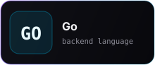
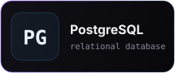
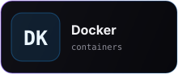
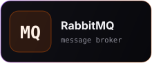
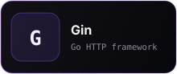
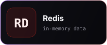
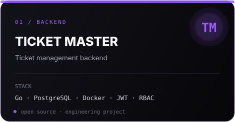
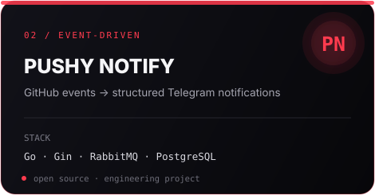
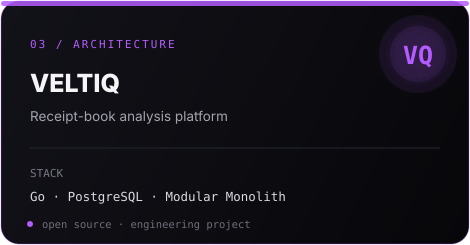

<div align="center">

# SypherFLS

### Backend Engineer

`Go` · `Backend` · `Systems`

<br>






<br>





</div>

<br>

## Selected Work

<div align="center">

<a href="https://github.com/SypherFLS">
  
</a>

<a href="https://github.com/SypherFLS">
  
</a>

<a href="https://github.com/SypherFLS">
  
</a>

</div>

<br>

## Focus

```text
backend engineering
system design
concurrency
databases
distributed systems
reliable software
```

<br>

<div align="center">


</div>

<br>

<div align="center">

```text
keep building.
```

</div>
