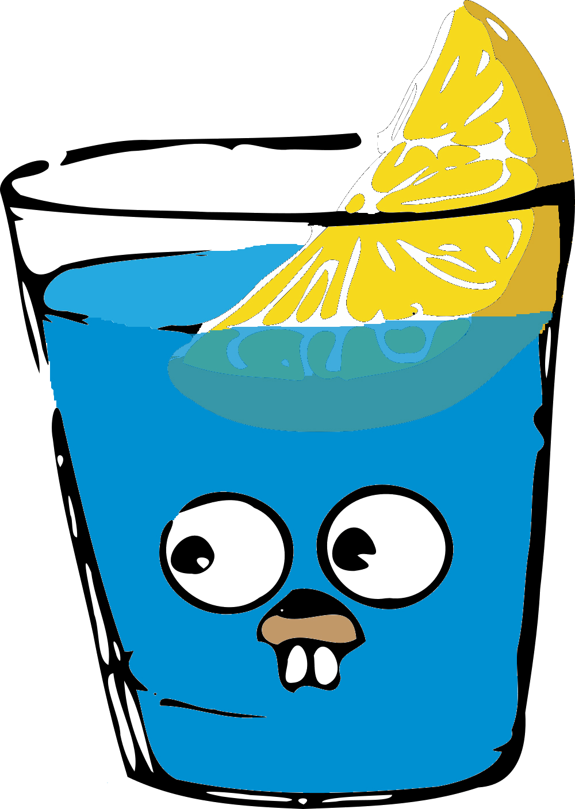

# Yo, I'm Sypher. Backend Engineer

 

 

  

<h2>Projects</h2>

<table>
<tr>
<td width="50%" valign="top">

<h3>Ticket-Master</h3>

Ticket management service.

</td>

<td width="50%" valign="top">

<h3>Pushy-Notify</h3>

Telegram bot for GitHub commit notifications.

</td>
</tr>

<tr>
<td width="50%" valign="top">

<h3>Veltiq</h3>

Receipt analytics service for small and medium-sized retail businesses.

</td>

<td width="50%" valign="top">

<h3>Backend Focus</h3>

Go services, queues and storage. APIs that stay up and say little.

</td>
</tr>
</table>

 

&nbsp;

  

<code>keep building.</code>

